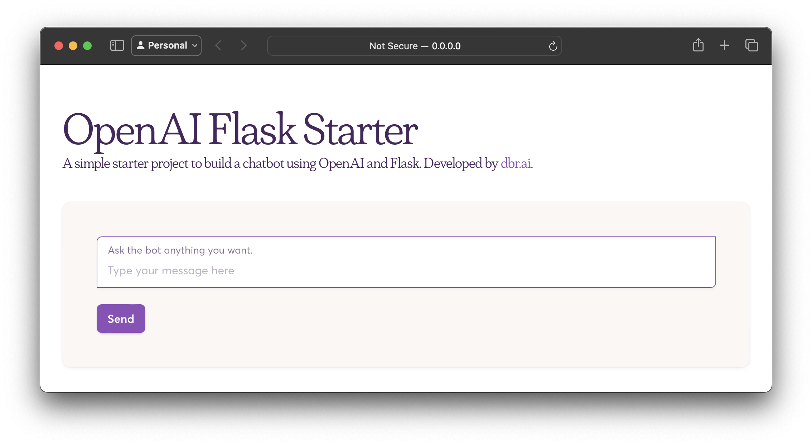

# OpenAI Flask Starter



This project demonstrates how to create a simple AI chatbot using Python, Flask, and OpenAI's Large Language Model (LLM) API. The chatbot generates human-like responses powered by GPT-4 (or GPT-3.5).

## Features

- **Chatbot**: Conversational AI powered by OpenAI's GPT models.
- **Web Interface**: Built using Flask to interact with the bot via a browser.
- **OpenAI Integration**: Utilizes the latest OpenAI API for chat completions.
- **Docker Support**: Ready for containerization with a `Dockerfile` and `docker-compose` setup.
- **Easy Setup**: Uses Python's built-in virtual environment.

## Prerequisites

- Python 3.7+
- OpenAI API key. You can get it [here](https://beta.openai.com/signup/).

## Installation

1. **Clone the Repository**:

   ```bash
   git clone https://github.com/datumbrain/openai-flask-starter.git
   cd openai-flask-starter
   ```

2. **Set Up Virtual Environment**:

   Create a virtual environment and activate it:

   ```bash
   python -m venv venv
   source venv/bin/activate  # On Windows use `venv\Scripts\activate`
   ```

3. **Install Dependencies**:

   Install the required packages using `requirements.txt`:

   ```bash
   pip install -r requirements.txt
   ```

4. **Set Up Your OpenAI API Key**:

   Add your OpenAI API key in `.env.sample` and rename the file to `.env`:

   ```bash
   OPENAI_API_KEY=your-api-key-here
   HTTP_PORT=5899    # change it as you like
   ```

5. **Run the Flask Application**:

   Start the Flask app by running:

   ```bash
   python main.py
   ```

   The app will be available at `http://127.0.0.1:5899/`.

## Docker Setup (Optional)

You can run the project in a Docker container using the following steps:

1. **Build the Docker Image**:

   ```bash
   docker-compose build
   ```

2. **Run the Application**:

   ```bash
   docker-compose up
   ```

   The app will be available at `http://127.0.0.1:5899/`.

## Project Structure

```raw
.
├── .dockerignore           # Files to ignore in Docker context
├── .env.sample             # Environment variable example file
├── .gitignore              # Files to ignore in git
├── Dockerfile              # Docker image setup
├── LICENSE                 # License information
├── README.md               # Project documentation
├── docker-compose.yml      # Docker Compose configuration
├── main.py                 # Flask server and chatbot logic
├── requirements.txt        # Project dependencies
└── templates/
    ├── index.html          # Frontend HTML for interacting with the chatbot
    └── styles/
        └── custom.css      # custom CSS styling
```

## Usage

Once the app is running, open your browser and go to `http://127.0.0.1:5899/`. Type a message in the input box, and the chatbot will respond using the GPT-4 model.

## License

This project is licensed under the MIT License.
